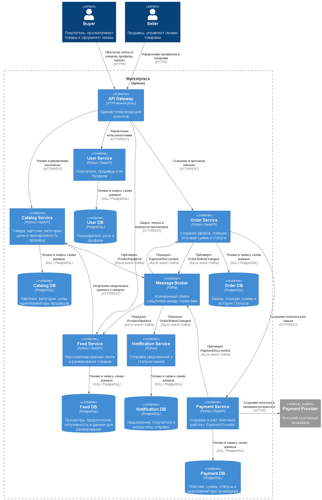

# Marketplace Architecture

## О проекте

Учебный проект по архитектуре маркетплейса: продавцы размещают товары, а покупатели получают персональную ленту, оформляют и оплачивают заказы. В проекте описана целевая архитектура и подготовлен один сервис для запуска в Docker.

## Что реализовано

- Только каркас Catalog Service на Python 3.12 и FastAPI.
- Endpoint `GET /health`, возвращающий HTTP `200 OK`.
- Бизнес-логика отсутствует.
- Остальные сервисы, API Gateway, Kafka и базы данных показаны только как целевая архитектура.

## Архитектура

Выбран вариант **Domain-based Microservices**: каждому бизнес-домену соответствует отдельный сервис. API Gateway принимает запросы клиентов, сервисы взаимодействуют через HTTP/REST и события Kafka. Payment Service работает с внешним платежным провайдером.

Подробное описание находится в [docs/architecture.md](docs/architecture.md).

## C4 Container Diagram



[Исходник диаграммы в PlantUML](docs/diagrams/container.puml).

## Домены

| Домен | Сервис | Ответственность |
| --- | --- | --- |
| User | User Service | Покупатели, продавцы и их профили |
| Catalog | Catalog Service | Товары, категории, цены и принадлежность продавцу |
| Feed | Feed Service | Персональная лента и ранжирование товаров |
| Order | Order Service | Состав заказа, стоимость позиций на момент оформления и статусы |
| Payment | Payment Service | Создание и учет платежей, работа с платежным провайдером |
| Notification | Notification Service | Уведомления о статусах заказа |

## Владение данными

В целевой архитектуре у каждого доменного сервиса своя БД. Общих баз и прямого доступа к чужим БД нет. Сервисы обмениваются данными через API или события.

## Взаимодействия

Синхронные:

- **HTTPS** — обращения клиентов к API Gateway и Payment Service к платежному провайдеру.
- **HTTP/REST** — запросы API Gateway к сервисам, Order Service к Payment Service и Feed Service к Catalog Service.

Асинхронные события передаются через **Kafka**:

| Событие | Отправитель | Получатель |
| --- | --- | --- |
| `PaymentSucceeded` | Payment Service | Order Service |
| `OrderStatusChanged` | Order Service | Notification Service |
| `ProductUpdated` | Catalog Service | Feed Service |

## Персонализация

Feed Service использует историю просмотров для определения предпочтений по категориям. Интерес к категории, популярность и свежесть товара формируют итоговый score для ранжирования. Для пользователя без истории учитываются популярность и свежесть.

Алгоритм не реализован и описан только на уровне архитектуры.

## Реализованный сервис

Catalog Service проверяется через endpoint:

```http
GET /health
```

Ответ с HTTP `200 OK`:

```json
{"status":"ok"}
```

## Структура проекта

```text
marketplace_architecture/
├── README.md
├── .gitignore
├── docker-compose.yml
├── docs/
│   ├── architecture.md
│   ├── decisions.md
│   └── diagrams/
│       ├── container.puml
│       └── container.png
└── services/
    └── catalog-service/
        ├── app/
        │   ├── __init__.py
        │   └── main.py
        ├── requirements.txt
        └── Dockerfile
```

## Запуск

Требуются Docker Engine (или Docker Desktop) и Docker Compose v2.
Из корня репозитория:

```sh
docker compose up --build
```

Проверка в другом терминале:

```sh
curl -i http://localhost:8000/health
```

Ожидаемый статус и тело ответа:

```text
HTTP/1.1 200 OK

{"status":"ok"}
```

В PowerShell можно использовать `curl.exe` вместо `curl`.

Проверка состояния контейнера:

```sh
docker compose ps
```

Остановка:

```sh
docker compose down
```

## Архитектурные решения

Рассмотрены три варианта:

- **Modular Monolith** — одно приложение с отдельными доменными модулями.
- **Domain-based Microservices** — отдельный сервис для каждого домена.
- **Coarse-grained Services** — несколько крупных сервисов, объединяющих близкие домены.

Варианты, их плюсы, минусы и trade-offs описаны в [docs/decisions.md](docs/decisions.md).

## Финальный выбор

Выбран **Domain-based Microservices**. Такое разбиение позволяет явно показать доменные границы, отдельное владение данными, синхронные и асинхронные взаимодействия. Это соответствует требованиям учебного задания.

Для реального небольшого MVP модульный монолит мог бы быть проще.
